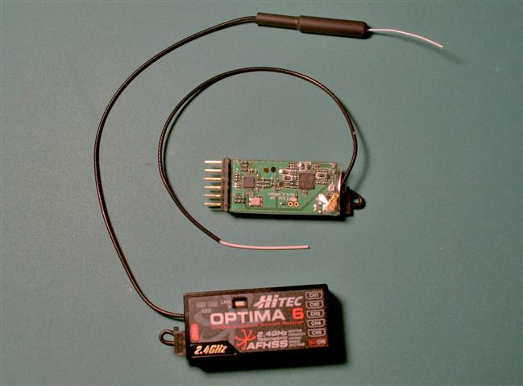
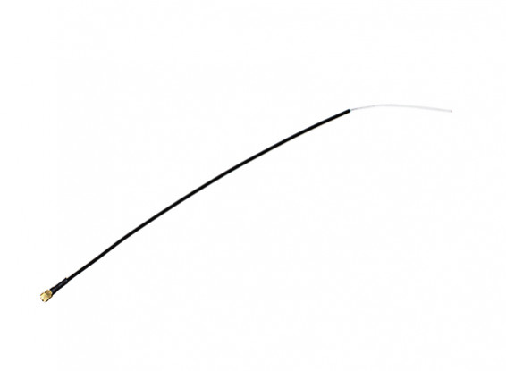
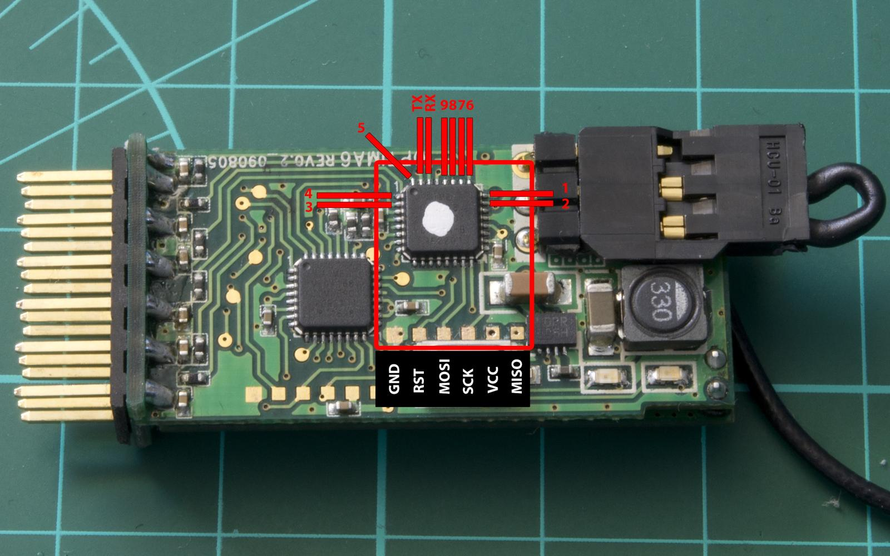
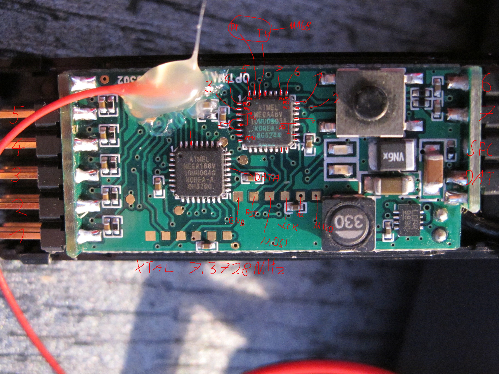
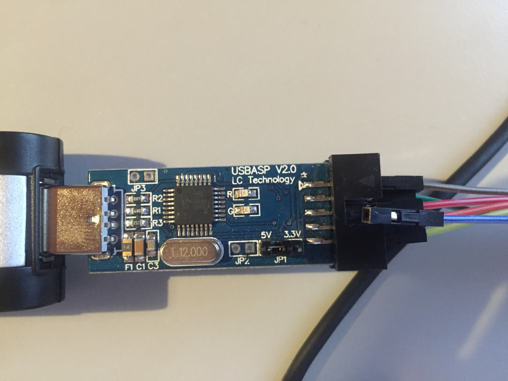
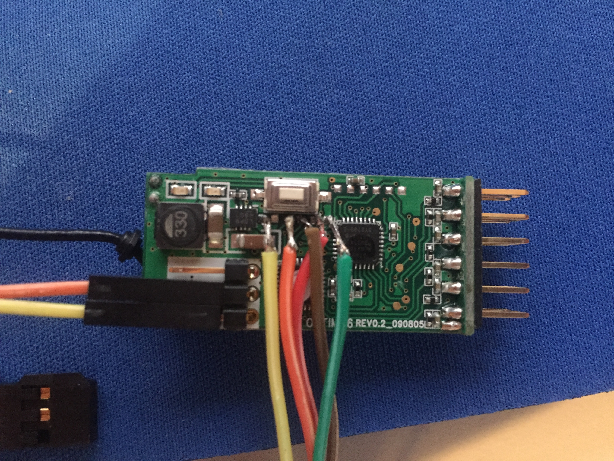

# Hitec Optima PPM

**Only attempt this modification if you know what you are doing and understand the risks.**

The lack of PPM output on Hitec Optima receivers is disappointing. To fill the void I have written firmware that will work with the regular Optima series (Optima Lite not tested) with a combined PPM output. The project origin is hosted (read only) [@code.google](https://code.google.com/p/untestedprototype/)

First of all there are two options to go for:
  * Flash onto the existing slave AVR of the receiver.
  * Solder to the RX line and intercept the signal with another microcontroller.

*Personaly I decided to go for the first option, but the process of flashing is still the same.*

**Flashing this firmware is not reversible and will void your warranty. I'm not responsible for anything that happens. Use at your own risk!**

Typical usecases are Optima 6 or 7 recievers because you can strip the body and keep them really minimal. A Optima  9 is kind of waste cause they will remain big and bulky. Small Optimas can be stripped like this:


and you can replace the big (BODA) antenna with a smaller one:

[HobbyKing](https://hobbyking.com/en_us/frsky-receiver-antenna-15-cm.html)

There are two variations of the firmware:

1. MIXED MODE
  * Regular PWM is output on the lower channels of the receiver (1 to N-1) and combined PPM on the highest channel (N).
2. SELECTABLE MODE (Not tested extensively, only bench tested)
  * Regular PWM on all channels or
  * Connect the signal pin to ground (with a bind plug) on channel 1. Enables combined PPM on the highest channel of the receiver.

All builds are available as .hex-file: [Releases](https://github.com/Zero3nna/optima-ppm/releases/)

If you want to build the firmware yourself, you will need to set up a proper build environment and use the provided Rakefile.

**Make sure you flash the correct microcontroller. You want the slave, not the controller for wireless transfer.** Optima 6 and 7 have the pads in similar locations.




I started by downloading the xxx_mixed.hex file for my reciever and connected the pins of the AVR device **USBAsp** to GPIO cables. **If you use a UBS-device with 5V VCC like mine, you have to leave out this pin on both sides and power your reciever serperatly over the BEC or SPC pins. Optima recievers operate with 3.3V**


Next step is to solder the corresponding cables to the Optima reciever pins.


I powered the reciever directly over the SPC-Pins with a lipo battery.
But before we power the reciever and connect the USBAsp, we have to install avrdude.
For windows you can follow this tutorial: [ladyada.net](http://www.ladyada.net/learn/avr/avrdude.html)

On linux:
```
apt-get install avrdude
```

I used Mac OS X with [Homebrew](http://brew.sh/):
```
brew install avrdude
```

Next thing is to find out the programmer and partno.
Have a look at the [ladyada.net](http://www.ladyada.net/learn/avr/avrdude.html) site if you are not sure about your programmer.
My programmer is ```usbasp``` and for partno we use ```m48``` because the chip on those Optima recievers is a **ATMega A48**.

So we are good to go now.
Navigate to your .hex-files location, power everything up and use the following command:
```
avrdude -c <programmer> -p m48 -U flash:w:<hexfile>
```

In my case:
```
avrdude -c usbasp -p m48 -U flash:w:optima_6_mixed.hex
```

You should now see some output like this:
```
avrdude: AVR device initialized and ready to accept instructions

Reading | ################################################## | 100% 0.00s

avrdude: Device signature = 0x1e9205
avrdude: NOTE: "flash" memory has been specified, an erase cycle will be performed
         To disable this feature, specify the -D option.
avrdude: erasing chip
avrdude: warning: cannot set sck period. please check for usbasp firmware update.
avrdude: reading input file "optima_6_mixed.hex"
avrdude: input file optima_6_mixed.hex auto detected as Intel Hex
avrdude: writing flash (1134 bytes):

Writing | ################################################## | 100% 0.81s

avrdude: 1134 bytes of flash written
avrdude: verifying flash memory against optima_6_mixed.hex:
avrdude: load data flash data from input file optima_6_mixed.hex:
avrdude: input file optima_6_mixed.hex auto detected as Intel Hex
avrdude: input file optima_6_mixed.hex contains 1134 bytes
avrdude: reading on-chip flash data:

Reading | ################################################## | 100% 0.85s

avrdude: verifying ...
avrdude: 1134 bytes of flash verified

avrdude: safemode: Fuses OK (E:01, H:DD, L:FD)

avrdude done.  Thank you.
```

Thats it! We can now use our reciever in PPM-Mode.
